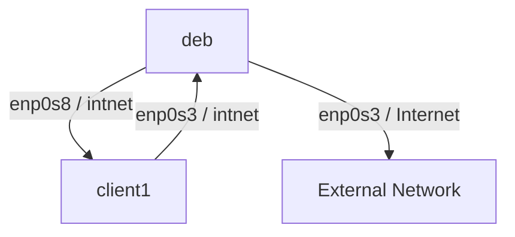
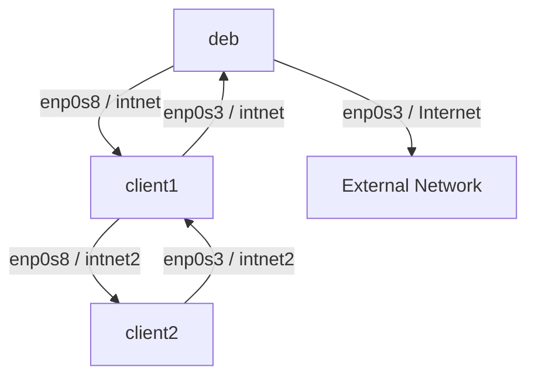

# Topology

Создадим топологию с двумя виртуальными машинами, которые будут подключены через внутреннюю сеть (intnet) и смогут обмениваться данными.

Далее легко масштабируем до 3 машин.

## Первые две машины

В VirtualBox клонируем виртуальную машину с Debian:

При клонировании  обязательно выбираем опцию "Generate new MAC address for all network adapters", чтобы избежать конфликтов с MAC адресами.

В настройках сети склонированной машины:

Adapter 1 - переключаем с NAT на Internal Network - intnet.



Теперь `deb` и `client1` подключены к одной внутренней сети (intnet):

- `deb` через `enp0s8`
- `client1` через `enp0s3`

Для начала настроим статический IP на обоих машинах.

На `deb`:

```sh
sudo nmcli con mod "Wired connection 2" \
    ipv4.addresses 192.168.15.1/24 \
    ipv4.method manual
```

На `client1`:

```sh
sudo nmcli con mod "Wired connection 1" \
    ipv4.addresses 192.168.15.5/24 \
    ipv4.method manual
```

Под капотом NetworkManager выполнит операции аналогичные следующим командам:

```bash
sudo ip addr add 192.168.15.5/24 dev enp0s3
sudo ip link set enp0s3 up

# Если нужно, добавляем маршрут по умолчанию
sudo ip route add default via 192.168.15.1 dev enp0s3
```

Теперь запускаем на `deb` tcpdump для прослушивания трафика, а с `client1` отправляем ping:

```sh
ping -c 1 192.168.15.1
```

Получаем:


## Третья машина

Клонируем `client1` в `client2`, как и раньше, с новым MAC адресом.

В настройках сети `client2` переключаем Adapter 1 с `intnet` на `intnet2`. Adapter 2 отключаем.  
Аналогично на машине `client1` переключаем Adapter 2 с `intnet` на `intnet2`.

Наша финальная топология выглядит так:



Аналогично настраиваем IP адреса:

- На `client1`: 192.168.20.1/24
- На `client2`: 192.168.20.5/24
